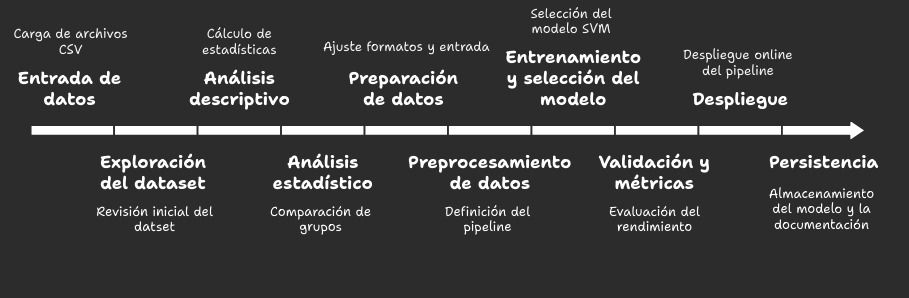

# 🧠 Clasificador Automático de Artículos Biomédicos

Este proyecto desarrolla un **clasificador automático de artículos biomédicos** 🩺 a partir de su título y resumen (abstract). La solución asigna los textos a uno de los siguientes dominios médicos:

- ❤️ Cardiovascular
- 🧠 Neurological
- 🧬 Oncological
- 🩸 Hepatorenal

La solución se basa en **Machine Learning supervisado** 🤖. El pipeline de procesamiento de texto utiliza TF-IDF para la vectorización y un **Support Vector Machine (SVM)** como modelo de clasificación. El SVM fue elegido por su robustez, su capacidad para manejar datos de alta dimensionalidad y las opciones de regularización para mejorar el rendimiento en escenarios con clases desbalanceadas.

---

## 🚀 Acceso al Proyecto

Puedes interactuar con el modelo y ver los resultados de dos maneras:

### 🌐 Aplicación Web
Accede a la aplicación web desplegada, donde puedes probar el clasificador sin necesidad de instalaciones.
**Nota: Recuerda leer el manual de uso que se encuentra al final del documento antes de comenzar tu experiencia en la plataforma.**
[Ir a la aplicación web ❤️](https://v0-medical-text-classifier.vercel.app/)
☁️ Ten en cuenta que el modelo puede tardar varios minutos en procesar, dependiendo del tamaño del conjunto de datos de prueba 😊.

### 💻 Notebook de Colab
Explora el proceso de desarrollo completo, desde el análisis exploratorio de datos hasta la evaluación del modelo en el siguiente notebook de Google Colab.
[Ver notebook en Google Colab](https://colab.research.google.com/drive/1gSH9f-nLw-whV7MiXg5xBT74eqq1TD4B?usp=sharing)
**Se recomienda siempre abrir y visualizar este notebook en Jupyter Notebook o Google Colab**.

---

## 🛠️ Estructura del Repositorio y Uso

La organización del proyecto sigue una **estructura modular** para mejorar la claridad y la **reutilización del código** ♻️. El código está escrito y formateado según la guía **PEP 8** para garantizar su legibilidad.

### Diagrama de la Solución



El diagrama explica el diseño de la solución, desde la ingesta de datos hasta la predicción, mostrando cómo las diferentes partes del proyecto se conectan entre sí.

### Estructura del Proyecto

```
├── notebooks/
│   └── 📄 Challenge_de_Clasificación_Biomédica_IA.ipynb  \# Notebook con EDA y entrenamiento del modelo.
├── Flujo de Trabajo/
│   ├── 📄 Flujo de Trabajo.jpg
├── model/
│   └── 📄 Clasification_model.pkl  \# Modelo de clasificación.
├── test/
│   └── 📄 Data1.csv \# Data para pruebas.
│   └── 📄 Data2.csv \# Data para pruebas.
│   └── 📄 Data3.csv \# Data para pruebas.
│   └── 📄 Data4.csv \# Data para pruebas.
├── 📄 README.md
├── 📄 requirements.txt  \# Lista de dependencias.
```
**Nota sobre los CSV de prueba**:

- En la carpeta `test/` se encuentran **4 CSV de ejemplo** que pueden usarse para probar el notebook.
- Si quieres ejecutar el notebook, Recuerda que, inmediatamente después de importar las librerías, debes modificar la ruta (path) según el csv de prueba que quieras usar.
- En caso de que quieras probar un **CSV personalizado** en la aplicación web:
  - Debe tener las columnas `title;abstract;group` (el `group` es opcional para validación).
  - El archivo **no debe superar las 1000 filas**, debido a que el modelo se carga en la versión gratuita de Hugging Face. Para eliminar esta limitación, sería necesario utilizar la **versión premium** de Hugging Face.
- Si pruebas desde el **notebook**, no hay límite en la cantidad de filas.

---

### 📦 Dependencias e Instalación
Para ejecutar el código localmente (si decides migrar del notebook a archivos `.py`), necesitas Python 3.8+ y las bibliotecas listadas en `requirements.txt`.

1.  Clona el repositorio:
    ```bash
    git clone [https://github.com/tu_usuario/nombre_del_repo.git](https://github.com/tu_usuario/nombre_del_repo.git)
    cd nombre_del_repo
    ```
2.  Instala las dependencias:
    ```bash
    pip install -r requirements.txt
    ```

---

## 📋 Manual de Uso

Este manual se centra en el uso de la aplicación web, que es la interfaz principal para los usuarios finales.

### 1. Carga de CSV
- Sube un archivo CSV con las columnas: `title`, `abstract` y, opcionalmente, `group` (para validación).
- El formato del archivo debe ser `title;abstract;group`.
- Haz clic en **"Procesar Predicciones"** para clasificar automáticamente todos los textos.

### 2. Predicción Manual
- Ingresa el **título** y el **resumen** del texto biomédico que deseas clasificar.
- Haz clic en **"Clasificar Texto"** para obtener la predicción instantánea.
- Los resultados incluyen la **categoría predicha** y el **nivel de confianza**.

### 3. Categorías de Clasificación
El sistema clasifica los textos en las siguientes categorías:

- **Neurological**: Textos sobre neurología y el sistema nervioso.
- **Cardiovascular**: Textos sobre cardiología y el sistema cardiovascular.
- **Oncological**: Textos sobre oncología y cáncer.
- **Hepatorenal**: Textos sobre hígado y riñones.

### 4. Dashboard de Resultados
- Visualiza estadísticas clave como la **precisión** y la **distribución de categorías**.
- Visualiza métricas como F1-score ponderado, accuracy, distribución de clases y la matriz de confusión. Para acceder a esta información, haz clic en el botón **Métricas Extendidas**.
- **Filtra los resultados** por categoría o por el origen de la predicción (CSV vs. Manual).
- **Exporta** los resultados en formato CSV para análisis posterior.

---

💡 **Consejos**
- Para obtener mejores resultados, asegúrate de que los textos estén en **inglés**.
- Los **títulos y resúmenes más descriptivos** tienden a generar clasificaciones más precisas.
````
